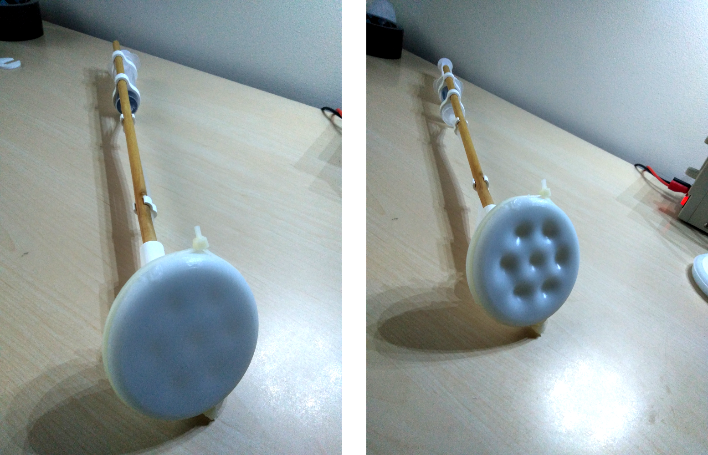
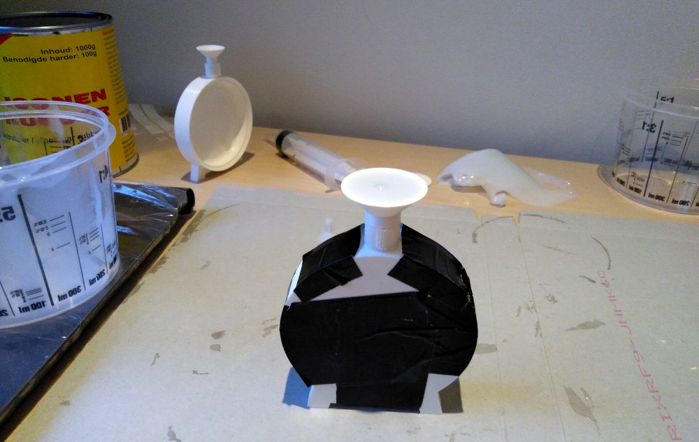
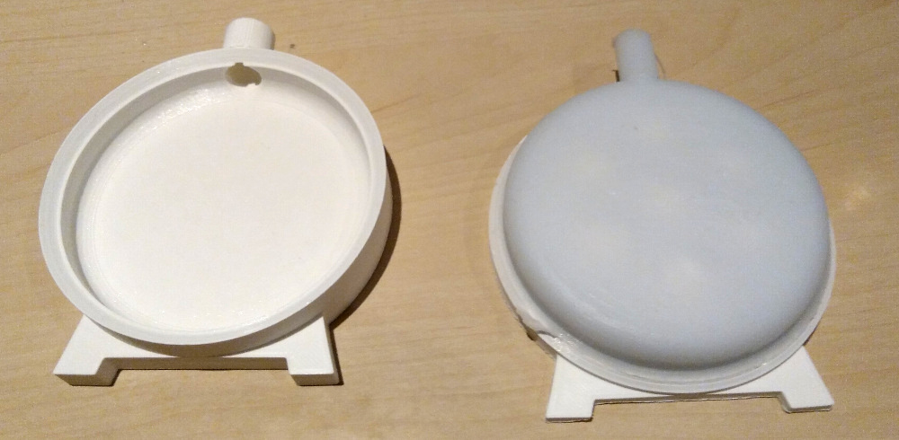

# Suction-Gripper-Demonstrator
Repository that contains a blueprint for a demonstrator model of a bio-inspired, suction-based gripper. This demonstrator was developed by a student team as part of a Bio-Inspired Design MSc course.

_Picture of the demonstrator (Swiss army knife for scale)_

## Description
What this gripper demonstrator is supposed to "demonstrate" is that an array of compliant suction cups can be used to generate substantial gripping force. A miniaturized derivative of such a design could potentially be used in medical applications as a surgical gripper, the current designs of which frequently feature metal "jaws" that often inflict unwanted trauma during surgery due to excess force. A suction-based gripper could spread this force out over a larger area and reduce the chance of complications.

The demonstrator works as follows: It features a head which can be used to "grip" objects. This head consists of a compliant (~Shore 30) material whose shape can be changed. Inside the head is a sealed chamber, and when pressure in the chamber is reduced, it pulls the compliant material inside. The compliant material is deformed in such a way that it creates suction cups on the other side, which then create a suction force between the head and whatever object is being grabbed. Many cephalopods use a similar principle to attach their limbs to many different objects, and as such, this design was inspired by these animals.

_Compliant head of the suction gripper in action. On the right, the syringe is used to reduce the pressure in the suction head to create small suction cups._

## Printable components
For the demonstrator model, some parts will have to be printed. This can be done out of PLA, and the printer does not have to be terribly fancy. The author used an Ender 3 Pro printer for all prints. The STL-files for the prints can be found in the `./STL/` folder.

To build the depicted demonstrator model, you will need to print the following parts:
| Qty    | Part     | Comment |
| ------------- |:-------------|:------|
| 1 | `silicone_mould_bottom_v2.stl` | Print such that the side with the casting negative is pointing up. |
| 1 | `silicone_mould_top_v2.stl` | Print such that the side with the casting negative is pointing up. |
| 1 | `silicone_mould_funnel.stl` | Print with the small side pointing up. |
| 1 | `stick_socket.stl` | Print such that the joint socket is pointing up. |
| 1 | `suction_head_casing.stl` | Print with the ball joint pointing up. |
| 1 | `suction_head_gridcover.stl` | Print with the small knobs pointing up. |
| 2 | `syringe_coupler.stl` | - |
| 2 | `tube_coupler.stl` | - |
| 1 | `syringe_lock.stl` | Optional if you want to lock the syringe in place. |

Printing settings used by author:
 - 20% filler or more.
 - <20 mm/s speed
 - <0.2 mm layer height
 - 1.2 mm wall thickness
 - Use tree supports for everything.

## Component list
**Materials/consumables**
 - 1 30 mL medical syringe
 - ~0.5 meters of medical tubing (4.5 mm inner diameter)
 - A mounting stick. The author used a 400 mm long wooden stick of 9.5 mm diameter.
 - PLA parts as listed above.
 - Super glue (such as cyanoacrylate).
 - Silicone-based kit or glue (the author used [Bison Poly Max](https://www.bison.net/en/product.6310168)). Many other glues (epoxy, cyanoacrylate, etc.) will **NOT** bond with silicone!
 - Latex/vinyl gloves.
 - Some zip ties.
 - Pourable silicone mix (the author used [Wilsor two-component silicone](https://www.wilsor.nl/product/siliconen-rubber/)).
 - Mixing cup for the silicone casting.
 - A stirring implement such as a wooden stick, for the silicone casting.
 - Kitchen scales.
 - Paper towels.

**Tools**
 - Duct tape.
 - Gluing clamps.
 - 120 grit and 400 grit sandpaper.
 - Vaseline.
 - Small files.
 - Hobby knife/army knife.
 - Calipers.

## Manufacturing and assembly

1. First print the parts, as this will take the most time. Gather all the other required tools in the meantime.

### Post-processing the 3D printed parts
2. Remove the excess supports on the printed parts.
3. Test the fit of the `suction_head_casing` and the `suction_head_gridcover`. Remove excess material from the outer edge and the six knobs of the `suction_head_gridcover`, and ensure that the six holes in the `suction_head_casing` are large enough. In the end, you should have a snug fit.
4. Carefully remove the excess material from the outer tube gasket, so that it will not leak when a tube is attached to it.
5. Sand the ball joint until smooth.
6. Using the 120 grit sandpaper, smooth the inner surfaces of the mould halves. Then continue this using 400 grit wet sanding, until the inner surfaces are nice and smooth. Any irregularities in these surfaces will show up in the silicone component as well so to prevent leaks, ensure that the inside of the mould is nice and smooth.
7. Using a small amount of super glue, bond the mould funnel to the mould bottom part. This will form the channel into which the silicone mixture will be poured. The mould is designed such that this channel is also the only riser, allowing for bubbles to escape from the same hole. The funnel will also ensure an excess of silicone at the top, allowing the fluid pressure to force the silicone into the mould.

### Casting the silicone component
8. Coat the inside of the mould with a thin layer of vaseline, so that the silicone cast will release easily. 
9. Close the mould halves and fix them in places using duct tape and/or gluing clamps. The mould is designed with inclined edges such that the two parts will centre by themselves. Ensure that the little feet on both sides of the mould align with one another properly, otherwise the mould will wobble during the casting process. 
10. Put on your gloves. Weigh off around 40-50 grams of silicone base, and mix it with the hardening component in the mixing ratio specified by the manufacturer. For the Winsor silicone used by the author, the base:hardener mixing ratio is 40:3. Stir for a few minutes until the components are thoroughly mixed.
11. Carefully pour the silicone mixture into the mould. You have about 15 minutes to do this before the silicone grows too inviscid to fill the mould properly. If you are unsuccessful, you can just wait for the silicone to harden, remove it, and repeat steps 8 through 11. Once the mould is full, repeatedly tap the mould on a hard surface to help any bubbles flow up and out of the mould. Afterwards, place the whole thing on its feet on a level surface, and let it cure for a few hours.

_Filled mould just after casting. Note the air bubble escaping at the top._

12. After the silicone has cured, break the glue connection between the funnel and the mould, either by twisting or cutting with a knife. Also cut through the layer of excess silicone.
13. Remove the clamps/duct tape, and gently separate the mould halves. The silicone part should come loose relatively easily, although you may have to tug a bit harder near the edges.

_Cured silicone cast just after removing one of the mould halves. Note the "umbilical cord" of excess silicone at the top._

14. Cut off the excess "umbilical cord" of silicone on the side of the cast. Be **very careful** however that you do not cut through the cast itself, as this will compromise the vacuum seal later on. Better safe than sorry.

### Assembling the suction head

15. Insert the `suction_head_gridcover` into the `suction_head_casing`. In the end, the gridcover should be flush with the casing.
16. Apply a liberal amount of silicone kit to the outer edge of the casing, where the silicone part will touch the casing. Spread out the kit until it is distributed evenly. Slide the silicone part over the casing. Fix it in place with zip ties. Leave to cure for at least two hours.

17. Test the quality of the seal by connecting a small length of tubing to the fitting on the casing, and the other end to a syringe. Pull the plunger and see how quickly air rushes in again. If this is in the order of seconds, consider re-gluing the part. This is without a doubt the most frustrating part of the build, and the author ended up building two head parts before managing a good enough seal with the glue.

### Assembling the prototype
17. Fit the `stick_socket` part onto the mounting stick. For me a friction fit was enough, but feel free to use glue if necessary.
18. Sand-fit the two `syringe_couplers` until they fit onto the syringe. Then insert the small holes of the `syringe_couplers` onto the mounting stick.
19. Cut a length of surgical tubing to size and fit one end to the syringe, and the other end to the fitting on the suction head.
20. Click the ball joint into place (take care you do not injure your fingers!).
21. Neatly manage the tube by using some of the `tube_couplers`.

That's it. By now you should have the suction gripper demonstrator.

## Demonstration
In the figures below you can see the gripper demonstrator being used to lift the can of silicone base from which it was made. The can was around 877 grams at the time of the test, which the gripper handled easily.

